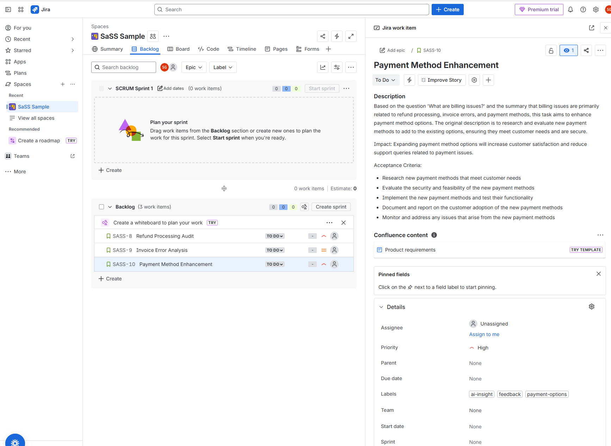

# Jira Integration Guide

GoInsight now includes a powerful Jira integration that automatically converts AI-generated insights into actionable Jira tickets.

## Overview

The Jira integration works in two steps:
1. **Get Insights**: Use `/api/ask` to analyze customer feedback and get AI-generated action items
2. **Create Tickets**: Use `/api/jira-tickets` to convert those action items into Jira tickets

## Setup

### 1. Get Your Jira API Token

1. Go to https://id.atlassian.com/manage-profile/security/api-tokens
2. Click "Create API token"
3. Give it a name (e.g., "GoInsight Integration")
4. Copy the generated token

### 2. Configure Environment Variables

Add these to your `.env` file:

```env
# Jira Configuration
JIRA_BASE_URL=https://your-domain.atlassian.net
JIRA_EMAIL=your-email@company.com
JIRA_API_TOKEN=your_jira_api_token_here
```

Replace:
- `your-domain` with your Jira workspace subdomain
- `your-email@company.com` with your Atlassian account email
- `your_jira_api_token_here` with the token from step 1

### 3. Restart the Service

```bash
docker compose up -d api
```

You should see: `Jira integration enabled` in the logs.

## Usage

### Step 1: Get Insights from Customer Feedback

```bash
curl -X POST http://localhost:8080/api/ask \
  -H "Content-Type: application/json" \
  -d '{
    "question": "What are the most critical billing issues?"
  }'
```

**Response:**
```json
{
  "question": "What are the most critical billing issues?",
  "summary": "Analysis shows refund processing delays affecting enterprise customers...",
  "recommendations": [
    "Improve the refund processing system to reduce delays",
    "Provide clearer communication about refund timelines"
  ],
  "actions": [
    {
      "title": "Investigate Refund Processing Delays",
      "description": "Analyze customer feedback to identify root causes..."
    },
    {
      "title": "Update Refund Process Documentation",
      "description": "Review and update documentation for clarity..."
    }
  ]
}
```

### Step 2: Convert Actions to Jira Tickets

Take the response from Step 1 and add a `meta` section with your Jira project details:

```bash
curl -X POST http://localhost:8080/api/jira-tickets \
  -H "Content-Type: application/json" \
  -d '{
    "question": "What are the most critical billing issues?",
    "summary": "Analysis shows refund processing delays affecting enterprise customers...",
    "recommendations": [
      "Improve the refund processing system to reduce delays",
      "Provide clearer communication about refund timelines"
    ],
    "actions": [
      {
        "title": "Investigate Refund Processing Delays",
        "description": "Analyze customer feedback to identify root causes...",
        "magnitude": 7.5
      },
      {
        "title": "Update Refund Process Documentation",
        "description": "Review and update documentation for clarity...",
        "magnitude": 4.5
      }
    ],
    "meta": {
      "project_key": "PROD",
      "default_issue_type": "Story",
      "default_labels": ["feedback", "ai-insight", "billing"]
    }
  }'
```

**Response:**
```json
{
  "ticket_specs": [
    {
      "project_key": "PROD",
      "issue_type": "Story",
      "summary": "Investigate Refund Processing Delays",
      "description": "Context: Analysis shows refund processing delays...\n\nImpact: Enterprise customers blocked...\n\nAcceptance Criteria:\n- Analyze customer feedback\n- Identify root causes\n- Document findings",
      "priority": "High",
      "labels": ["feedback", "ai-insight", "billing", "refunds"],
      "components": ["billing"]
    }
  ],
  "created_tickets": [
    {
      "id": "10234",
      "key": "PROD-567",
      "self": "https://your-domain.atlassian.net/rest/api/3/issue/10234"
    }
  ],
  "errors": []
}
```

### Example Generated Ticket in Jira

The system creates well-structured tickets with:
- **Priority**: Automatically calculated from magnitude (High priority shown)
- **Labels**: Smart labels like `ai-insight`, `feedback`, `payment-options`
- **Description**: Detailed context with Impact and Acceptance Criteria sections
- **Summary**: Clear, concise title under 120 characters



*Screenshot shows "Payment Method Enhancement" ticket (SASS-10) created from AI insights with High priority, detailed description, and relevant labels.*

## Request Parameters

### `meta` Object (Required)

| Field | Type | Required | Description |
|-------|------|----------|-------------|
| `project_key` | string | Yes | Your Jira project key (e.g., "PROD", "ENG") |
| `default_issue_type` | string | No | Default: "Story". Can be "Task", "Bug", "Epic", etc. |
| `default_labels` | array | No | Default: ["feedback", "ai-insight"]. Base labels for all tickets |

### How the AI Generates Tickets

The system analyzes your actions and automatically:

1. **Calculates magnitude scores** (0-10) for each action based on:
   - Urgent keywords (critical, emergency, security, outage, crash) → +2.5
   - Impact keywords (revenue, customer, billing, compliance, performance) → +1.5
   - Investigation tasks (investigate, analyze, research) → +1.0
   - Documentation tasks (documentation, update, review) → -1.0
   - Mentions in recommendations → +0.5 per mention

2. **Assigns priorities** based on magnitude:
   - magnitude ≥ 8.0 → `Highest` (Critical/blocking issues)
   - magnitude ≥ 6.5 → `High` (Serious problems)
   - magnitude ≥ 4.0 → `Medium` (Normal feature work)
   - magnitude < 4.0 → `Low` (Minor improvements)

3. **Crafts clear summaries** (under 120 characters)

4. **Writes detailed descriptions** including:
   - Context from your original question
   - The action description
   - Impact assessment (if obvious)
   - Acceptance criteria (3-6 bullet points)

5. **Adds smart labels** based on content (e.g., "billing", "refunds", "performance")

6. **Suggests components** if product areas are clear

## Examples

### Example 1: Security Issues

```bash
# Step 1: Get insights
curl -X POST http://localhost:8080/api/ask \
  -H "Content-Type: application/json" \
  -d '{"question": "Show me critical security concerns"}'

# Step 2: Create tickets (add meta to response)
curl -X POST http://localhost:8080/api/jira-tickets \
  -H "Content-Type: application/json" \
  -d '{
    ...response from step 1...,
    "meta": {
      "project_key": "SEC",
      "default_issue_type": "Bug",
      "default_labels": ["security", "urgent"]
    }
  }'
```

### Example 2: Feature Requests

```bash
# Step 1: Get insights
curl -X POST http://localhost:8080/api/ask \
  -H "Content-Type: application/json" \
  -d '{"question": "What features are customers requesting?"}'

# Step 2: Create tickets
curl -X POST http://localhost:8080/api/jira-tickets \
  -H "Content-Type: application/json" \
  -d '{
    ...response from step 1...,
    "meta": {
      "project_key": "FEAT",
      "default_issue_type": "Story",
      "default_labels": ["feature-request", "customer-feedback"]
    }
  }'
```

## Workflow Integration

### Option 1: Two-Step Manual Process

1. PM asks a question via `/api/ask`
2. PM reviews the insights and actions
3. PM calls `/api/jira-tickets` to create approved tickets

### Option 2: Automated Pipeline (Future)

You can build a workflow that:
1. Runs daily analysis of new feedback
2. Generates insights automatically
3. Creates draft Jira tickets for PM review
4. Links back to original feedback data

## Troubleshooting

### "Jira integration is not configured"

**Solution:** Check that all three env vars are set:
```bash
docker compose logs api | grep -i jira
```

Should show: `Jira integration enabled`

### "Jira API returned status 401"

**Problem:** Invalid credentials

**Solution:**
- Verify your email matches your Atlassian account
- Regenerate your API token
- Ensure no extra spaces in `.env` file

### "Jira API returned status 404"

**Problem:** Project key doesn't exist

**Solution:**
- Check the project key in Jira (it's shown in the URL and project settings)
- Ensure your account has permission to create issues in that project

### "meta.project_key is required"

**Problem:** Missing required field

**Solution:** Always include `meta.project_key` in your request:
```json
{
  ...
  "meta": {
    "project_key": "YOUR_PROJECT_KEY"
  }
}
```

## Security Notes

- **API Token Storage**: The Jira API token is stored in your `.env` file and is never logged or exposed
- **Permissions**: The integration uses your Jira account permissions - it can only create tickets in projects you have access to
- **Authentication**: Uses Jira Cloud REST API v3 with Basic Auth (email + API token)
- **No Data Leakage**: Customer feedback data is only used for generating ticket content, never sent to third parties

## API Reference

### POST /api/jira-tickets

**Request Body:**
```typescript
{
  question: string;          // Original question from /api/ask
  summary: string;           // Insight summary from /api/ask
  recommendations: string[]; // Recommendations from /api/ask
  actions: Array<{           // Actions from /api/ask
    title: string;
    description: string;
    magnitude?: number;      // Optional: 0-10 score (auto-calculated if omitted)
  }>;
  meta: {                    // Jira configuration
    project_key: string;     // Required: Jira project key
    default_issue_type?: string;     // Optional: "Story", "Task", "Bug", etc.
    default_labels?: string[];       // Optional: Base labels
  };
}
```

**Response (Success - 200):**
```typescript
{
  ticket_specs: Array<{      // Generated ticket specifications
    project_key: string;
    issue_type: string;
    summary: string;
    description: string;
    priority: "Highest" | "High" | "Medium" | "Low";
    labels: string[];
    components: string[];
    epic_link: null;
  }>;
  created_tickets: Array<{   // Actually created Jira issues
    id: string;
    key: string;             // e.g., "PROD-567"
    self: string;            // Jira API URL
  }>;
  errors: string[];          // Any errors that occurred
}
```

**Response (Error - 400/500/503):**
```typescript
{
  error: string;
}
```

## Next Steps

1. **Set up Jira credentials** in your `.env` file
2. **Try the example** with your Jira project key
3. **Review the created tickets** in Jira
4. **Customize labels and components** for your workflow
5. **Integrate into your PM workflow**

Happy ticket creation! 🎫✨
